13.2. Mock Exam -2 (Solutiohortal + master $ master $ 

```sh
kubectl get nodes -o=jsonpath='{range .items[*]}{.metadata.name}{"\t"}{.spec. taints}{"\n"}{end}'

 master [map[effect:Noschedule key:node-role.kubernetes.io/master]] node01 [map[effect:NoSchedule key: app_type value:alpha]] node02 node03 master $ So now when you run, those who can see it clearly that the muzzle has changed and Nordstrom has a tent, K 07:23 / 32:22 A 1 0939 NEST LX > 发送 720P ** ** 1) 
```


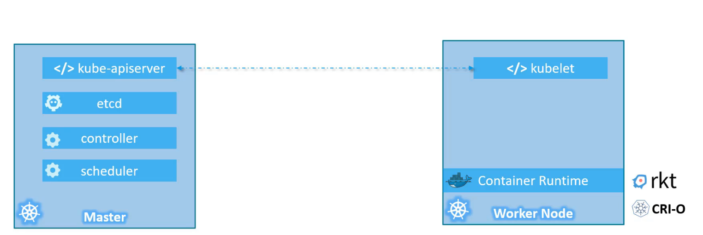

```sh
kubectl describe deployments.apps frontend-deployment | grep -i image
```


```sh
kubectl create deployment name --image=nginx
kubectl scale deployment name --replicas=3
```


```sh
kubectl run redis --image=redis --dry-run=client -o yaml > pod.yaml
```


```sh
kubectl expose pod redis --name redis-service --port 6379 --target-port 6379
```


```sh
kubectl describe svc redis-service
```


```sh
kubectl run redis --image=redis --dry-run=client -o yaml > pod.yaml
kubectl apply -f pod.yaml
kubectl edit pod redis
```


```sh
kubectl create -f replicaset-definition.yaml
kubectl get replicaset
kubectl get pods
```


#### how scale:


```sh
kubectl create serviceaccount dashboard-sa
kubectl get serviceaccount
kubectl describe serviceaccount dashboard-sa
kubectl describe secret dashboard-sa
```


```sh
kubectl taint nodes node1 app=blue:NoSchedule
kubectl taint nodes node1 key1=value1:NoSchedule-
```


```sh
kubectl explain pod --recursive | less
kubectl explain pod --recursive | grep tolerations -A5 
```


```sh
kubectl describe node master
kubectl taint node master xxx:NoSchedule-
```

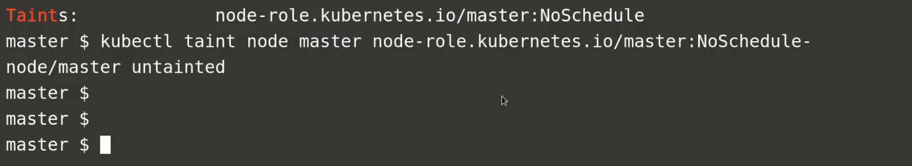

configmap


node

```sh
kubectl label nodes foo unhealthy=true
```


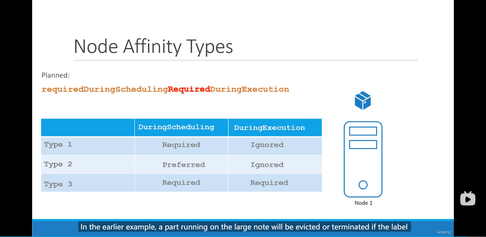

```

```


Secret


taints and tolerations vs. node affinity


   

security context
Linux Capability


multi-container


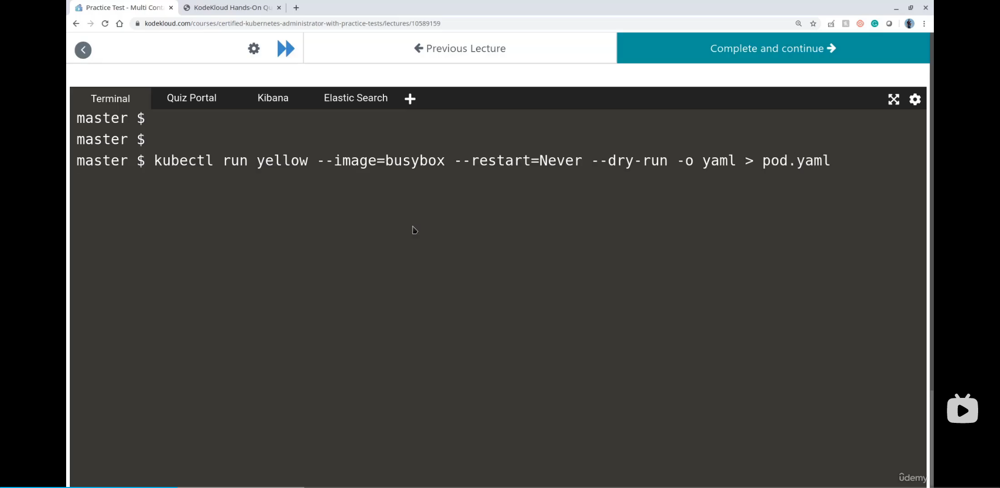


observability


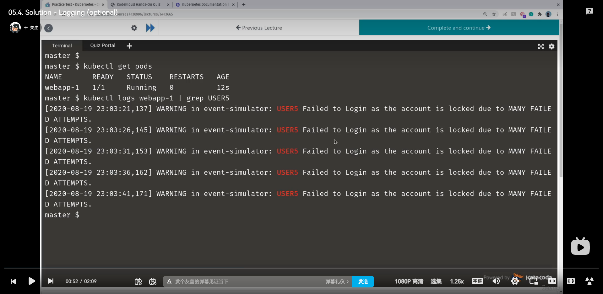

metric server


Pod design: labels, selector and annotation


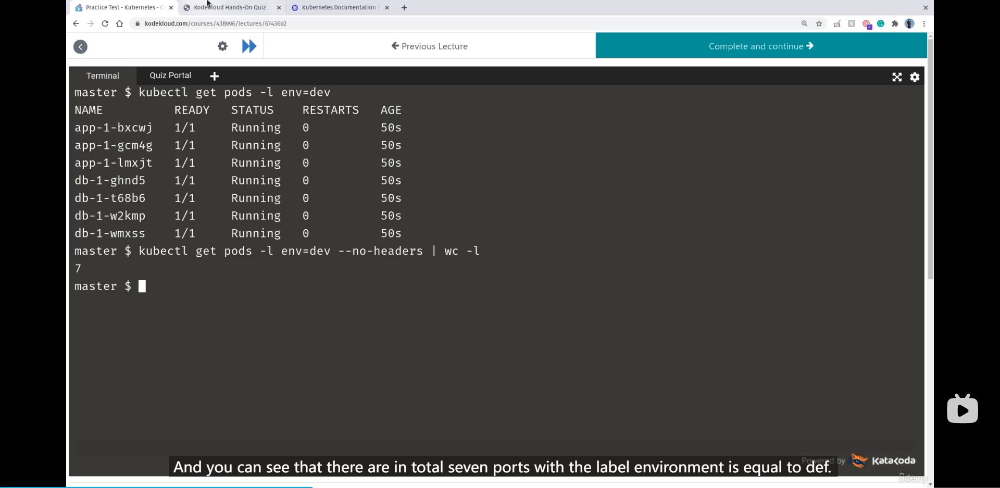

Rollout


 


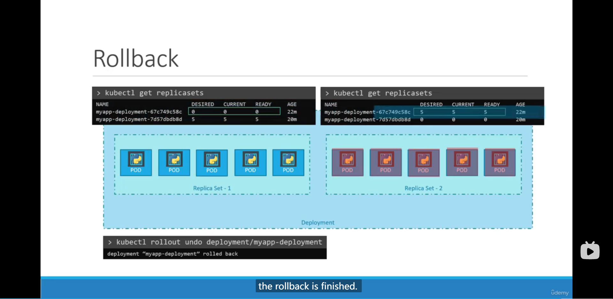


deployment

revision 1


revision2: modify the nginx version and apply again


revision3: modify the version of nginx by the cmd


revision4: undo to take us back to the deployment  of revision 2 that we applied at that time and apply it again.


revision5: modify the version of nginx to a error version

revison6: undo the deployement to rollback to former deployment of revision5 which actually use the deployment of revision4


Job and cron job


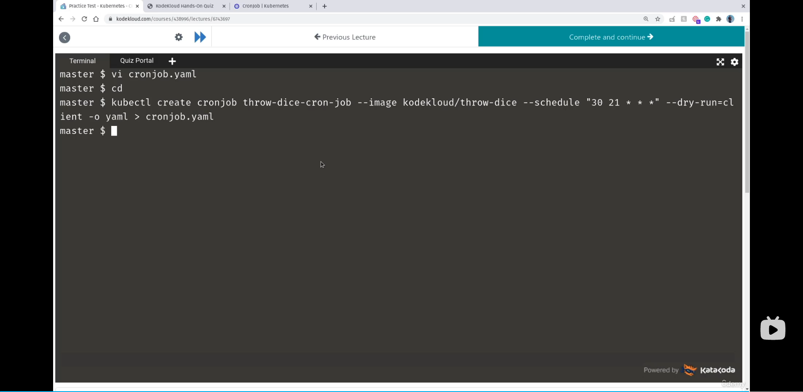


Services


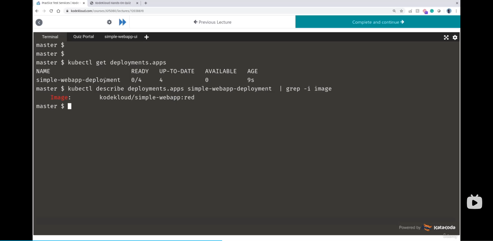


Ingress


Why bring in a additional layer called proxy


set the DNS to point to the ip of the LB


Network Policy


Persist Volume


In Retain mode, the PV will both not be deleted and be reused by other pvc while the former bound pvc was deleted.


In Delete mode, the PV will both be deleted while the former bound pvc was deleted and thus the storage would be freeing up.

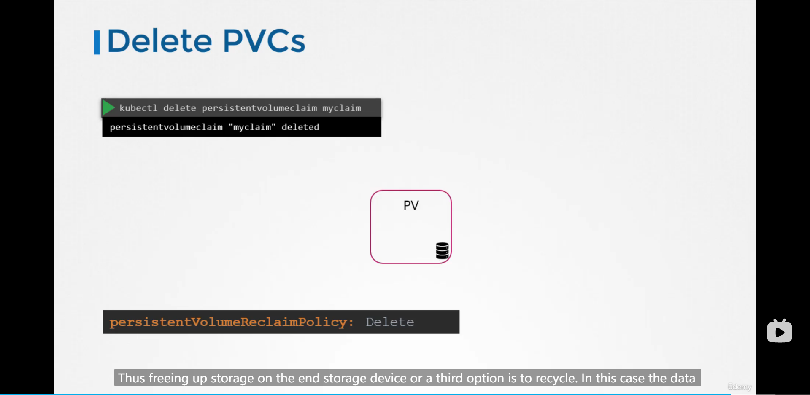


Pod --> volumes--> pvc--->pv--->storage

storage class


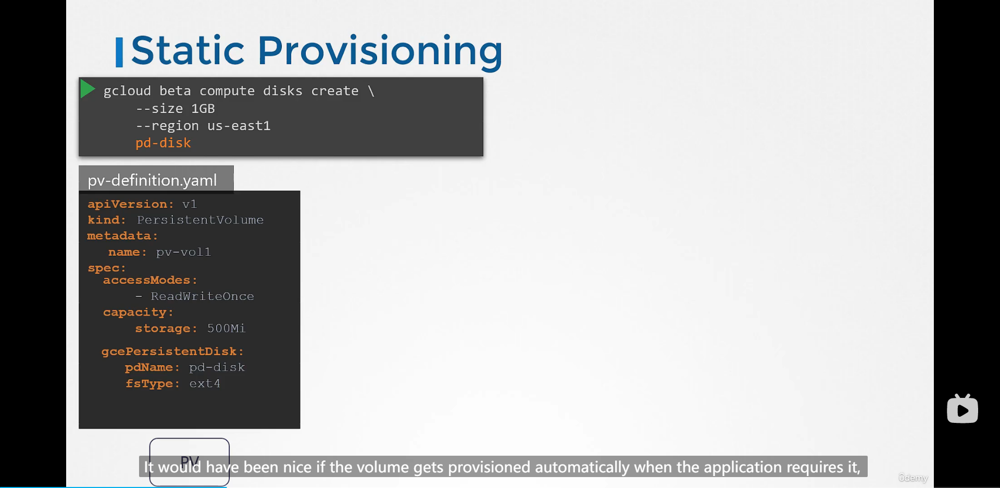


https://kubernetes.io/docs/concepts/storage/storage-classes/

https://docs.aws.amazon.com/AWSEC2/latest/UserGuide/ebs-volume-types.html

Stateful sets


Headless service


Storage In stateful sets


Cluster Role


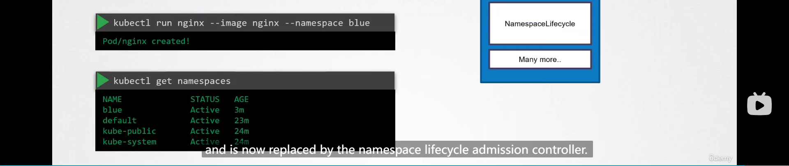


Define, build, modify docker image


Authentication, Authorization and Admission Control


Validating and mutating Admission Controller


 

Authentication


Authorization


CSR


Security Kubeconfig


```sh
[going@dev config]$ k config --help
Modify kubeconfig files using subcommands like "kubectl config set current-context my-context"

 The loading order follows these rules:

  1.  If the --kubeconfig flag is set, then only that file is loaded. The flag may only be set once and no merging takes
place.
  2.  If $KUBECONFIG environment variable is set, then it is used as a list of paths (normal path delimiting rules for
your system). These paths are merged. When a value is modified, it is modified in the file that defines the stanza. When
a value is created, it is created in the first file that exists. If no files in the chain exist, then it creates the
last file in the list.
  3.  Otherwise, ${HOME}/.kube/config is used and no merging takes place.

Available Commands:
  current-context Display the current-context
  delete-cluster  Delete the specified cluster from the kubeconfig
  delete-context  Delete the specified context from the kubeconfig
  delete-user     Delete the specified user from the kubeconfig
  get-clusters    Display clusters defined in the kubeconfig
  get-contexts    Describe one or many contexts
  get-users       Display users defined in the kubeconfig
  rename-context  Rename a context from the kubeconfig file
  set             Set an individual value in a kubeconfig file
  set-cluster     Set a cluster entry in kubeconfig
  set-context     Set a context entry in kubeconfig
  set-credentials Set a user entry in kubeconfig
  unset           Unset an individual value in a kubeconfig file
  use-context     Set the current-context in a kubeconfig file
  view            Display merged kubeconfig settings or a specified kubeconfig file

Usage:
  kubectl config SUBCOMMAND [options]

Use "kubectl <command> --help" for more information about a given command.
Use "kubectl options" for a list of global command-line options (applies to all commands).
```


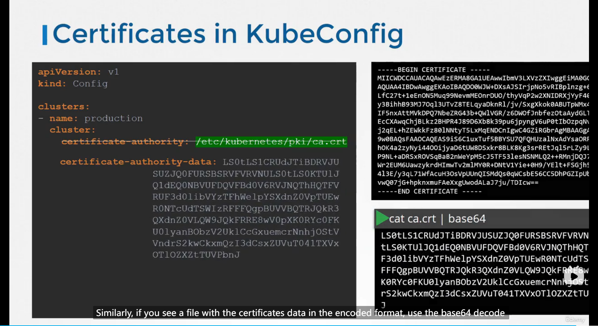


https://kubernetes.io/docs/reference/kubernetes-api/workload-resources/pod-v1/


Authorization


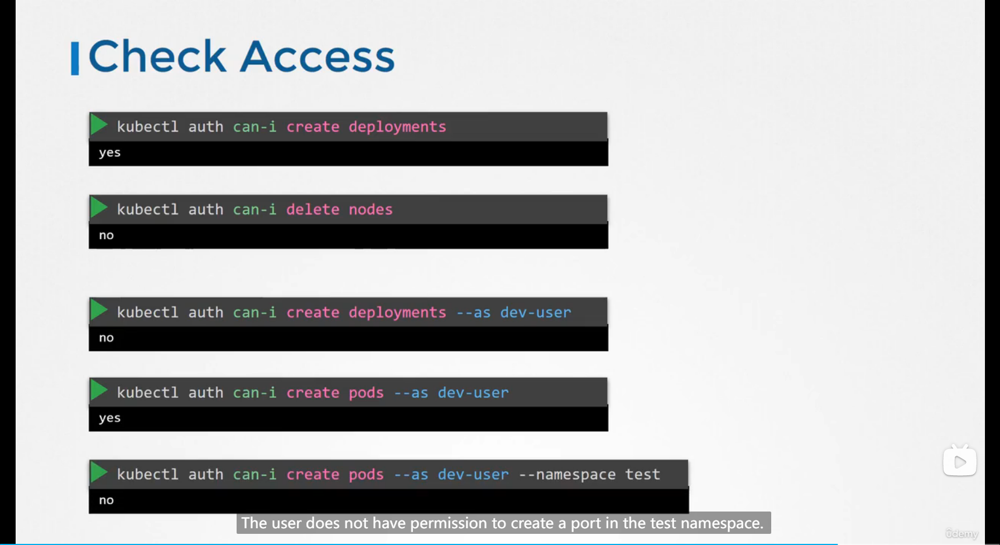


Time management

1. Attempt all questions
2. Don't get stuck in any question even it's easy, don't spend too much time on it, mark it down and skip to the next one
3. Do all the trouble shoot you want after you have attempted all the questions.
4. Get good with YAML

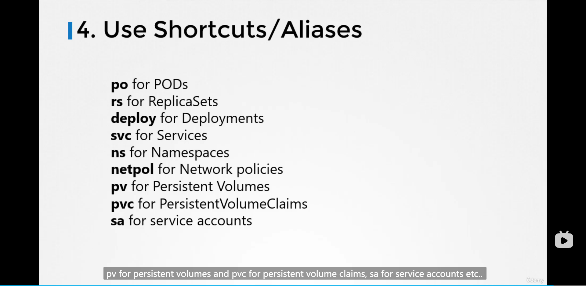


 Solution Lighting Lab 1


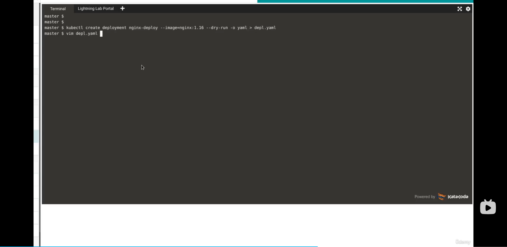


Solution Lighting Lab2


#### Mock exam


#### Reference:

[kubectl-commands](https://kubernetes.io/docs/reference/generated/kubectl/kubectl-commands)